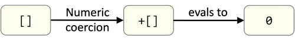
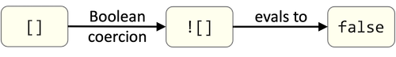
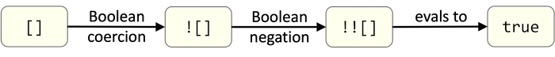
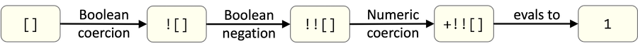
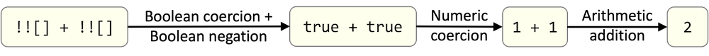
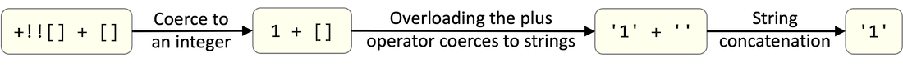

# Hieroglyphy - Taking JavaScript Type Coercion to Its Illogical Conclusion

The coding in this repo is a fork of [Hieroglyphy](https://github.com/alcuadrado/hieroglyphy), an original idea by [Patricio Palladino](https://github.com/alcuadrado/) in which every character in a JavaScript statement or even entire script can be encoded using a minimal alphabet consisting of some combination of:

* The three bracket pairs `[]`, `{}` and `()`,
* The plus sign `+`, and
* The exclamation mark `!`

The encoded string represents an executable JavaScript statement or program that can be decoded using `eval`, or executed directly.

This takes JavaScript's type coercion to its illogical conclusion!

***WARNING!***<br>
When encoded using Hieroglyphy, a JavaScript program could easily swell in size to 3 orders of magnitude larger than the original!

I have rewritten the original functionality as an ES6 module and significantly optimised it.

## Usage

`hieroglyphy.mjs` is a standalone module that can be included in your larger project.

```javascript
import {
  encodeScript,
  encodeString,
  encodeNumber,
} from "./hieroglyphy.mjs"
```

You can also perform simple tests in the NodeJS REPL (where `node --version` is >=18):

```bash
$ node
Welcome to Node.js v18.14.2.
Type ".help" for more information.
> let hieroglyphy = await import('./hieroglyphy.mjs')
undefined
> hieroglyphy.encodeNumber("1")
'+!![]'
> eval(hieroglyphy.encodeNumber("99"))
99
> hieroglyphy.encodeString("a")
'(+{}+[])[+!![]]'
> hieroglyphy.encodeString("b")
'([]+{})[!![]+!![]]'
> hieroglyphy.encodeString("c")
'([]+{})[!![]+!![]+!![]+!![]+!![]]'
> hieroglyphy.encodeString("abc")
'(+{}+[])[+!![]]+([]+{})[!![]+!![]]+([]+{})[!![]+!![]+!![]+!![]+!![]]'
> eval(hieroglyphy.encodeString("abc"))
'abc'
>
```

# How It Works

The following explanation is based on Patricio's (now unavailable) blog in which he described the inner workings of the application.
The overall structure of this blog has been followed, but in some places, the contents has been rewritten.

## The Encoding Alphabet

The object of this crazy exercise is to see if we can encode every character than might occur in a JavaScript program into a minimal alphabet.
Many alphabets could do the job, but just for fun, I tried to keep it as small as possible, using only the following characters:

* `[` and `]` to access array elements, objects properties, get numbers and coerce values to strings.
* `(` and `)` to call functions and avoid parsing errors.
* `+` to perform arithmetic addition, coerce values to numbers, and when overloaded, to perform string concatenation.
* `!` to perform both Boolean negation and Boolean coercion.
* `{` and `}` to get `NaN` and the infamous string `[object Object]`

## Pulling Ourselves Up By Our Bootstraps - The Basic Data Types

Using only the characters in our minimal alphabet, we can immediately represent two basic JavaScript data types:

* `[]` The empty list, and
* `{}` The empty object

By performing different sequences of type coercion one these simple values, we can derive the primitive Boolean values of `true` and `false`; from which we can then derive the integer values `0` and `1`.

## Primitive Values

By performing numeric coercion on an empty list, we obtain integer `0`



By performing Boolean coercion on an empty list, we obtain the Boolean primitive `false`



If we then perform Boolean negation on `![]` we obtain `true`



Finally, we can derive integer `1` by performing numeric coercion on `!![]`



## Natural Numbers

We have seen above that when a Boolean value appears in an arithmetic expression, `false` is coerced to `0` and `true` is coerced to `1`.  Knowing this we can derive the natural counting numbers.

Since `2` is `1 + 1`, we can rewrite `1 + 1` as `true + true` and still get `2`.

Further, we know from above that `true` can be encoded as `!![]`; therefore `1 + 1` can be rewritten as:



So now we can generate the first 10 counting numbers:

```javascript
+[]                                                           // 0
+!![]                                                         // 1
!![] + !![]                                                   // 2
!![] + !![] + !![]                                            // 3
!![] + !![] + !![] + !![]                                     // 4
!![] + !![] + !![] + !![] + !![]                              // 5
!![] + !![] + !![] + !![] + !![] + !![]                       // 6
!![] + !![] + !![] + !![] + !![] + !![] + !![]                // 7
!![] + !![] + !![] + !![] + !![] + !![] + !![] + !![]         // 8
!![] + !![] + !![] + !![] + !![] + !![] + !![] + !![] + !![]  // 9
```

## String Conversion

If all the operands supplied to the plus `+` operator are either numeric or can safely be interpreted numbers, then `+` performs arithmetic addition as expected.
Hence, these two statements are equivalent:

```javascript
   1 + 2 = 3
true + 2 = 3
```

However, if plus `+` is passed any non-numeric operands, then the operator is said to be "overloaded" and its behaviour switches from arithmetic addition to string concatenation.
The reason for this switch of behaviour is that JavaScript must perform type conversion that is guaranteed never to fail:

* A string does not necessarily represent a number (what is the numeric value of `'cat'`?)
* A number can always be represented a string

So `1 + '2' = '12'` and `'cat' + 3 = 'cat3'`

How does this fact help us here?

From the list of the natural numbers above, we can see that the encoded representation of integer `9` is 44 characters long, and this total will only grow larger as larger numbers are represented.

At the moment, we would have to represent `17` as the sum of seventeen `true`s:

```javascript
!![] + !![] + !![] + !![] + !![] + !![] + !![] + !![] + !![] + !![] + !![] + !![] + !![] + !![] + !![] + !![] + !![]   // 17
```

However, if we convert integers `1` and `7` to strings and then concatenate, we will have a shorter representation.

Given that our minimal alphabet consists only of the characters `+!(){}[]`, how do we coerce a value to a string?

The answer is to overload the plus `+` operator, thus forcing the conversion of the operands to strings.
This can be done by concatenating our numeric value to an empty list:



So simply by adding `+[]` to the end of each digit, we can obtain that digit's string representation:

```javascript
+[] + []                                                           // '0'
+!![] + []                                                         // '1'
!![] + !![] + []                                                   // '2'
!![] + !![] + !![] + []                                            // '3'
!![] + !![] + !![] + !![] + []                                     // '4'
!![] + !![] + !![] + !![] + !![] + []                              // '5'
!![] + !![] + !![] + !![] + !![] + !![] + []                       // '6'
!![] + !![] + !![] + !![] + !![] + !![] + !![] + []                // '7'
!![] + !![] + !![] + !![] + !![] + !![] + !![] + !![] + []         // '8'
!![] + !![] + !![] + !![] + !![] + !![] + !![] + !![] + !![] + []  // '9'
```

## Character Cache: First Checkpoint

So far, we are able to encode the 10 digit characters `0` to `9`, so we will place them into a character cache that so far contains:

| Character | Encoding
|---|---
| `'0'` | `+[]+[]`
| `'1'` | `+!![]+[]`
| `'2'` | `!![]+!![]+[]`
| `'3'` | `!![]+!![]+!![]+[]`
| `'4'` | `!![]+!![]+!![]+!![]+[]`
| `'5'` | `!![]+!![]+!![]+!![]+!![]+[]`
| `'6'` | `!![]+!![]+!![]+!![]+!![]+!![]+[]`
| `'7'` | `!![]+!![]+!![]+!![]+!![]+!![]+!![]+[]`
| `'8'` | `!![]+!![]+!![]+!![]+!![]+!![]+!![]+!![]+[]`
| `'9'` | `!![]+!![]+!![]+!![]+!![]+!![]+!![]+!![]+!![]+[]`

That's a start, but now we need to find a way to encode the letters of the alphabet.

## Extracting Characters from Keywords etc

Now that we have both the integers and their string representations, we can start to derive the encoding for some alphabetic characters:

***Q:*** What does JavaScript return if you access a non-existent array element?<br>
***A:*** `undefined`

Using our minimal alphabet, we can obtain the keyword `undefined` by accessing element `0` of an empty array: `[][0]`.

Further to this, we know that integer `0` is `+[]`, so we can get `undefined` from `[][+[]]`.

If we now perform the same string conversion trick as above, we can extract the letters from the character string `'undefined'`:

```javascript
// Access element zero of an empty array
[][+[]] -> undefined

// Convert the keyword to a character string
[][+[]] + [] -> 'undefined'

// Place the string in parentheses then perform array element lookup to extract individual characters
([][+[]]+[])[0]   // 'undefined[0]' -> 'u'
([][+[]]+[])[1]   // 'undefined[1]' -> 'n'
([][+[]]+[])[2]   // 'undefined[2]' -> 'd'
([][+[]]+[])[3]   // 'undefined[3]' -> 'e'
([][+[]]+[])[4]   // 'undefined[4]' -> 'f'
([][+[]]+[])[5]   // 'undefined[5]' -> 'i'
```

The only thing we need to modify here is the fact that we cannot directly use an integer as the array index.
So we need to substitute each integer for its encoded representation:

```javascript
// Substitute the integer index for the encoded integer
([][+[]]+[])[+[]]                        // 'undefined[0]' -> 'u'
([][+[]]+[])[+!![]]                      // 'undefined[1]' -> 'n'
([][+[]]+[])[!![]+!![]]                  // 'undefined[2]' -> 'd'
([][+[]]+[])[!![]+!![]+!![]]             // 'undefined[3]' -> 'e'
([][+[]]+[])[!![]+!![]+!![]+!![]]        // 'undefined[4]' -> 'f'
([][+[]]+[])[!![]+!![]+!![]+!![]+!![]]   // 'undefined[5]' -> 'i'
```

Let's now repeat the same trick, but this time, extract the characters from the values `true`, `false`, `NaN` and `[object Object]`.

```javascript
![]                              //  false
![]+[]                           // 'false'

(![]+[])[+[]]                    // 'false'[0] = 'f'
(![]+[])[+!![]]                  // 'false'[1] = 'a'
(![]+[])[!![]+!![]]              // 'false'[2] = 'l'
(![]+[])[+!![]+!![]+!![]]        // 'false'[3] = 's'
(![]+[])[+!![]+!![]+!![]+!![]]   // 'false'[4] = 'e'

!![]                             //  true
!![]+[]                          // 'true'

(!![]+[])[+[]]                   // 'true'[0] = 't'
(!![]+[])[+!![]]                 // 'true'[1] = 'r'
(!![]+[])[+!![]+!![]]            // 'true'[2] = 'u'
(!![]+[])[+!![]+!![]+!![]]       // 'true'[3] = 'e'
```

In cases where we have multiple ways to encode the same character (so far, we have three ways to encode the letter `'e'`), the shortest encoding will be used.

If we attempt to coerce an empty object `{}` to a number, we get `NaN`, which can then be converted to a string, placed in parentheses and chopped up to give us encodings for the letters `'N'` and `'a'`:

```javascript
+{}              //  NaN
+{}+[]           // 'NaN'
(+{}+[])[+[]]    // 'N'
(+{}+[])[+!![]]  // 'a'
```

Although the encoding for `'a'` derived from `'false'[1]` is the same length as the encoding derived from `'NaN'[1]`, we'll use the `'NaN'` version as the string from which the character is being obtained is shorter.

```javascript
[]+{}                                                 //  [object Object]
[]+{}+[]                                              // '[object Object]'
([]+{}+[])[+[]]                                       // '[object Object]'[0] -> '['
([]+{}+[])[+!![]]                                     // '[object Object]'[1] -> 'o'
([]+{}+[])[!![]+!![]]                                 // '[object Object]'[2] -> 'b'
([]+{}+[])[!![]+!![]+!![]]                            // '[object Object]'[3] -> 'j'
([]+{}+[])[!![]+!![]+!![]+!![]+!![]]                  // '[object Object]'[5] -> 'c'
([]+{}+[])[!![]+!![]+!![]+!![]+!![]+!![]+!![]]        // '[object Object]'[7] -> ' '
([]+{}+[])[!![]+!![]+!![]+!![]+!![]+!![]+!![]+!![]]   // '[object Object]'[8] -> 'O'

// The index to the ']' character in '[object Object]' is 14, so the encoding is shorter if the
// index is built by concatenating '1' and '4' then coercing the string to an integer
           +!![]+[]                                   // '1'
                        !![]+!![]+!![]+!![]+[]        // '4'
          (+!![]+[]) + (!![]+!![]+!![]+!![]+[])       // '1' + '4'
        +((+!![]+[]) + (!![]+!![]+!![]+!![]+[]))      // +'14' -> 14
({}+[])[+((+!![]+[]) + (!![]+!![]+!![]+!![]+[]))]     // '[object Object]'[14] -> ']'
```

## Tricks with Number Representations

Now that we have the string representation of the digits and the letter `'e'`, we can construct strings like `'1e100'` and `'1e1000'`, which when cast to numbers would result in `1e+100` and `Infinity`.
Then, by coercing the numbers back to strings, we can obtain the characters `'y'`, `'I'` and `'+'`.

To obtain the `'+'` sign, we first need to construct the number `1e+100`.
This can be done by concatenating the characters `'1' + 'e' + '1' + '0' +'0'`, then coercing the string to a number:

```javascript
  +'1e100'          // Coerce string '1e100' -> number 1e+100
 (+'1e100')+[]      // Overload plus (1e+100)+[] -> string '1e+100'
((+'1e100')+[])[2]  // Extract character at index 2 -> '+'
```

Now using the encoded values for `'e'`, `1` and `0`:

```javascript
 +(+!![]+(!![]+[])[+!![]+!![]+!![]]+(+!![])+(+[])+(+[]))                 // Number 1e+100
 +(+!![]+(!![]+[])[+!![]+!![]+!![]]+(+!![])+(+[])+(+[]))+[]              // Coerce to string '1e100'
(+(+!![]+(!![]+[])[+!![]+!![]+!![]]+(+!![])+(+[])+(+[]))+[])[!![]+!![]]  // Extract character at index 2 -> '+'
```

If we now create the number `1e1000`, this is too large for JavaScript to store as a 64-bit floating point number, so instead, it simply returns the word `Infinity`.
This is very helpful because we now have access to the characters `'I'` and `'y'`

```javascript
 +(+!![]+(!![]+[])[+!![]+!![]+!![]]+(+!![])+(+[])+(+[])+(+[]))           // Number Infinity
 +(+!![]+(!![]+[])[+!![]+!![]+!![]]+(+!![])+(+[])+(+[])+(+[]))+[]        // Coerce to string 'Infinity'
(+(+!![]+(!![]+[])[+!![]+!![]+!![]]+(+!![])+(+[])+(+[])+(+[]))+[])[+[]]  // Extract character at index 0 -> 'I'
                                                                         // Extract character at index 7 -> 'y'
(+(+!![]+(!![]+[])[+!![]+!![]+!![]]+(+!![])+(+[])+(+[])+(+[]))+[])[!![]+!![]+!![]+!![]+!![]+!![]+!![]]
```

## Second Checkpoint

Now we have added quite a few extra letters to our encoding table:

| Character | Derived from | Encoding
|---|---|---
| `'+'` | `'1e+100'[2]`           | `(+(+!![]+(!![]+[])[+!![]+!![]+!![]]+(+!![])+(+[])+(+[]))+[])[!![]+!![]]`
| `'['` | `'[object Object]'[0]`  | `([]+{}+[])[+[]]`
| `']'` | `'[object Object]'[14]` | `({}+[])[+((+!![]+[])+(!![]+!![]+!![]+!![]+[]))]`
| `' '` | `'[object Object]'[7]`  | `([]+{}+[])[!![]+!![]+!![]+!![]+!![]+!![]+!![]]`
| `'a'` | `'NaN'[1]`              | `(+{}+[])[+!![]]`
| `'b'` | `'[object Object]'[2]`  | `([]+{}+[])[!![]+!![]]`
| `'c'` | `'[object Object]'[5]`  | `([]+{}+[])[!![]+!![]+!![]+!![]+!![]]`
| `'d'` | `'undefined'[2]`        | `([][+[]]+[])[!![]+!![]]`
| `'e'` | `'true'[3]`             | `(!![]+[])[+!![]+!![]+!![]]`
| `'f'` | `'false'[0]`            | `(![]+[])[+[]]`
| `'i'` | `'undefined'[5]`        | `([][+[]]+[])[!![]+!![]+!![]+!![]+!![]]`
| `'j'` | `'[object Object]'[3]`  | `([]+{}+[])[!![]+!![]+!![]]`
| `'l'` | `'false'[2]`            | `(![]+[])[!![]+!![]]`
| `'N'` | `'NaN'[0]`              | `(+{}+[])[+[]]`
| `'n'` | `'undefined'[1]`        | `([][+[]]+[])[+!![]]`
| `'O'` | `'[object Object]'[8]`  | `([]+{}+[])[!![]+!![]+!![]+!![]+!![]+!![]+!![]+!![]]`
| `'o'` | `'[object Object]'[1]`  | `([]+{}+[])[+!![]]`
| `'r'` | `'true'[1]`             | `(!![]+[])[+!![]]`
| `'s'` | `'false'[3]`            | `(![]+[])[!![]+!![]+!![]]`
| `'t'` | `'true'[0]`             | `(!![]+[])[+[]]`
| `'u'` | `'undefined'[0]`        | `([][+[]]+[])[+[]]`
| `'y'` | `'Infinity'[7]`         | `(+(+!![]+(!![]+[])[+!![]+!![]+!![]]+(+!![])+(+[])+(+[])+(+[]))+[])[!![]+!![]+!![]+!![]+!![]+!![]+!![]]`

That's a pretty good list, but we're still a long way off a complete alphabet, let alone all the graphics symbols.


## Gathering functions from available characters

By combining those characters, we can only get these JavaScript functions and type names: `call`, `concat`, `constructor`, `join`, `slice` and `sort`.

Playing with our alphabet and these strings, we can get the following functions:

`Function` from `[]["sort"]["constructor"]`<br>
`Array` from `array["constructor"]`<br>
`Boolean` from `false["constructor"]`<br>
`Number` from `0["constructor"]`<br>
`Object` from `{}["constructor"]`<br>
`String` from `string["constructor"]`<br>
`Function.prototype.call` from `f["call"]`<br>
`String.prototype.concat` from `string["concat"]`<br>
`Array.prototype.slice` from `array["slice"]`<br>
`Array.prototype.join` from `array["join"]`<br>
`Array.prototype.sort` from `array["sort"]`

Unluckily, none of these functions would give us new characters, but don’t loose your hope yet!

One interesting function that becomes available is `unescape` which gives us all the ASCII characters by calling `unescape("%" + <HEX_ASCII_VALUE>)`.

All we're missing to get `unescape` is the `'p'` character.
So once again we make a trade-off, sacrificing some more portability to get it.
If we know that we are in a webpage served over HTTP or HTTPS we can assume that by casting window.location to string, and getting its third character we would obtain the precious `'p'`.

But how can we obtain the `window.location` object if we don’t have access to window yet?
Luckily JavaScript, being so permissive, would give that object by doing this:


`Function("return location")()`

And with `location` now we can have three more characters `'h'`, `'p'`, `'/'`, `escape` and `unescape` functions!

If we could get the character `'%'` we would be able to get the rest by calling `unescape("%" + <HEX_ASCII_VALUE>)`.
Luckily, escaping `'['` yields the string `'%5B'`, and from that, we can obtain the percentage sign.

Finally, all we need to transform a script into symbols, is reading it as a string, encoding it in our alphabet, and use Function as eval.

# Room from improvement

Both this article and Hieroglyphy are just proof of concepts, there is plenty of room from improvements:

* Once we were able to generate all ASCII characters, more effort needs to be made to ensure we get the shortest representation.
* When targeting modern browsers only, btoa would be a great help yielding lots of characters in shorter sequences.
* Depending on the target, one may select a bigger alphabet for reducing the encoding size.
* If we know the domain where the script would be run, more characters can be derived from it.
